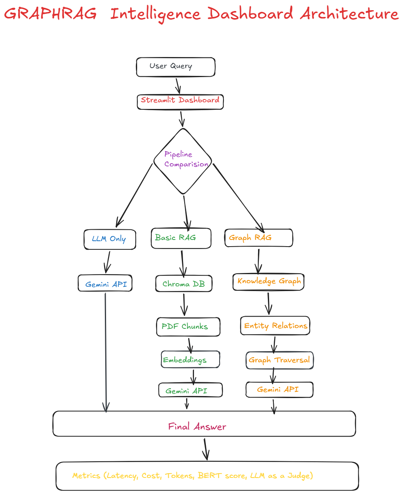
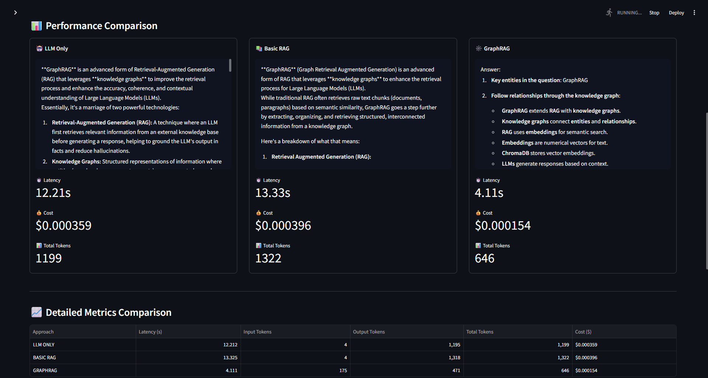

# GraphRAG Intelligence Dashboard

This project compares:

- LLM Only
- Basic RAG
- GraphRAG

using Gemini API, embeddings, ChromaDB, and knowledge graphs.

## Features

- Streamlit Dashboard
- PDF ingestion
- GraphRAG pipeline
- Benchmark metrics
- Side-by-side comparison

## Architecture



## Dashboard


## Tech Stack

- Python
- Gemini API
- Streamlit
- ChromaDB
- NetworkX

## Run Project

```bash
streamlit run dashboard/final_dashboard.py